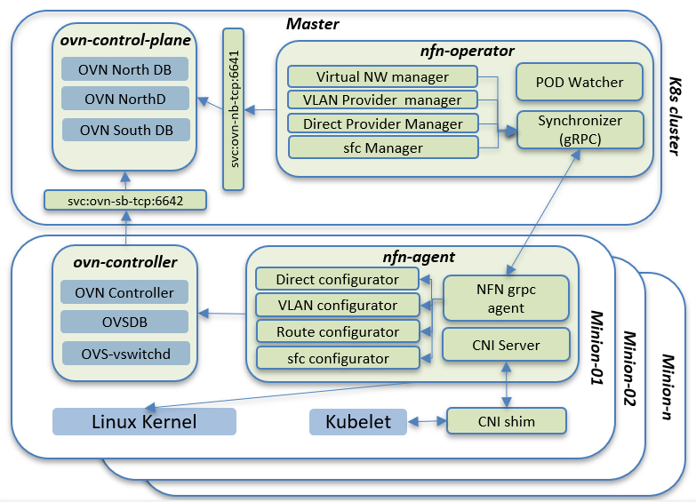
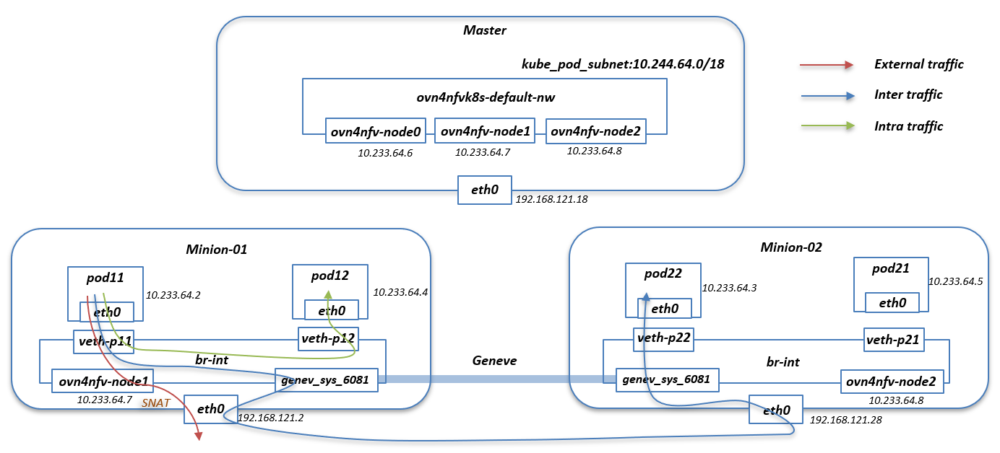

# Nodus - Network Controller
Nodus is Network controller in Kubernetes that address multiple network use case as below
- Multi ovn network support
- Multi-interface ovn support
- Multi-IP address support
- Dynamic creation of virtual networks
- Route management across virtual networks and external networks
- Service Function chaining(SFC) support in Kubernetes
- SRIOV Overlay networking (WIP)
- OVN load balancer (WIP)

Nodus is latin word for "knot". Nodus converge multiple kubernetes networking use cases in a single network controller.

## How it works

OVN4NFV consist of 4 major components
- OVN control plane
- OVN controller
- Network Function Network(NFN) k8s operator/controller
- Network Function Network(NFN) agent

OVN control plane and OVN controller take care of OVN configuration and installation in each node in Kubernetes. NFN operator runs in the Kubernetes master and NFN agent run as a daemonset in each node.

### OVN4NFV architecture blocks


#### NFN Operator
* Exposes virtual, provider, chaining CRDs to external world
* Programs OVN to create L2 switches
* Watches for PODs being coming up
 * Assigns IP addresses for every network of the deployment
 * Looks for replicas and auto create routes for chaining to work
 * Create LBs for distributing the load across CNF replicas
#### NFN Agent
* Performs CNI operations.
* Configures VLAN and Routes in Linux kernel (in case of routes, it could do it in both root and network namespaces)
* Communicates with OVSDB to inform of provider interfaces. (creates ovs bridge and creates external-ids:ovn-bridge-mappings)

### Networks traffice between pods


ovn4nfv-default-nw is the default logic switch create for the default networking in kubernetes pod network for cidr 10.233.64.0/18. Both node and pod in the kubernetes cluster share the same ipam information.

### Service Function Chaining Demo


In general production env, we have multiple Network function such as SLB, NGFW and SDWAN CNFs.

There are general 3 sfc flows are there:
* Packets from the pod to reach internet: Ingress (L7 LB) -> SLB -> NGFW -> SDWAN CNF -> External router -> Internet
* Packets from the pod to internal server in the corp network: Ingress (L7 LB) -> SLB -> M3 server
* Packets from the internal server M3 to reach internet: M3 -> SLB -> NGFW -> SDWAN CNF -> External router -> Internet

OVN4NFV SFC currently support all 3 follows. The detailed demo is include [demo/sfc-setup/README.md](./demo/sfc-setup/README.md)

# Quickstart Installation Guide
### kubeadm

Install the [docker](https://docs.docker.com/engine/install/ubuntu/) in the Kubernetes cluster node.
Follow the steps in [create cluster kubeadm](https://kubernetes.io/docs/setup/production-environment/tools/kubeadm/create-cluster-kubeadm/) to create kubernetes cluster in master
In the master node run the `kubeadm init` as below. The ovn4nfv uses pod network cidr `10.210.0.0/16`
```
    $ kubeadm init --kubernetes-version=1.19.0 --pod-network-cidr=10.210.0.0/16 --apiserver-advertise-address=<master_eth0_ip_address>
```
Ensure the master node taint for no schedule is removed and labelled with `ovn4nfv-k8s-plugin=ovn-control-plane`
```
nodename=$(kubectl get node -o jsonpath='{.items[0].metadata.name}')
kubectl taint node $nodename node-role.kubernetes.io/master:NoSchedule-
kubectl label --overwrite node $nodename ovn4nfv-k8s-plugin=ovn-control-plane
```
Deploy the ovn4nfv Pod network to the cluster.
```
    $ kubectl apply -f deploy/ovn-daemonset.yaml
    $ kubectl apply -f deploy/ovn4nfv-k8s-plugin.yaml
```

Ensure the configmap `ovn-controller-network` data `OVN_SUBNET` matches the pod network cidr as well in `deploy/ovn4nfv-k8s-plugin.yaml`
Join worker node by running the `kubeadm join` on each node as root as mentioned in [create cluster kubeadm](https://kubernetes.io/docs/setup/production-environment/tools/kubeadm/create-cluster-kubeadm/)

### kubespray

Kubespray support the ovn4nfv as the network plugin- please follow the steps in [kubernetes-sigs/kubespray/docs/ovn4nfv.md](https://github.com/kubernetes-sigs/kubespray/blob/master/docs/ovn4nfv.md)

## Comprehensive Documentation

- [How to use](doc/how-to-use.md)
- [Configuration](doc/configuration.md)
- [Development](doc/development.md)

## Contact Us

For any questions about ovn4nfv k8s , feel free to ask a question in #general in the [ICN slack](https://akraino-icn-admin.herokuapp.com/), or open up a https://jira.opnfv.org/issues/.

* Srinivasa Addepalli <srinivasa.r.addepalli@intel.com>
* Ritu Sood <ritu.sood@intel.com>
* Kuralamudhan Ramakrishnan <kuralamudhan.ramakrishnan@intel.com>

